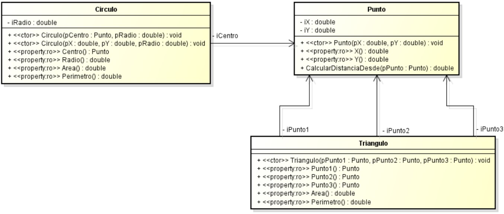
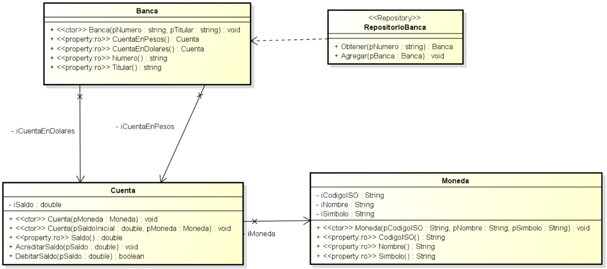
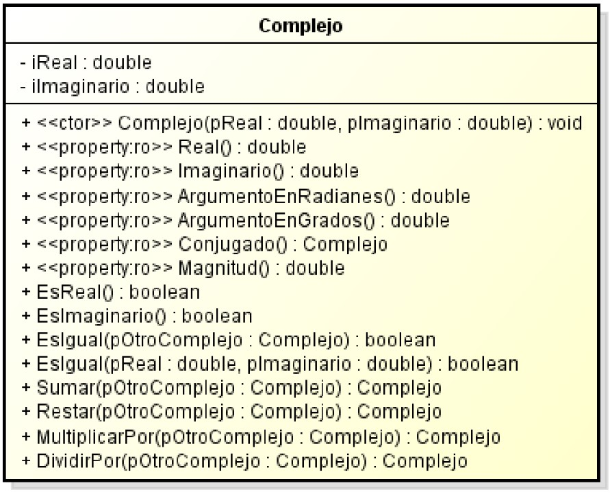

# Trabajo Práctico N° 2

## Ejercicio 1

Se recibe un requerimiento de un cliente el cual quiere una aplicación de consola con la cual pueda obtener de una forma fácil los valores de área y perímetro de figuras
geométricas. Las figuras requeridas son punto, círculo y triángulo. El cliente quiere que se presente un menú para seleccionar la figura y que después se pueda ingresar los valores de los ejes X e Y que definen el tamaño de las mismas sin importar la unidad de medida. 

Las funcionalidades que debe poseer la aplicación son las siguientes:
- Distancia entre dos puntos.
- Área y perímetro de un círculo.
- Área y perímetro de un triángulo.

También se recibe un diagrama de clases del diseñador de su equipo de desarrollo el cual define objetos de dominio que se deben crear para satisfacer los requerimientos. Además se indica que se debe utilizar el patrón de diseño GRASP _Controlador de Fachada_ para desacoplar la lógica del dominio de la interfaz.

Desarrolle una aplicación que satisfaga el requerimiento de basándose en el diseño y a las indicaciones realizadas. Implemente casos de prueba unitarios para las clases que considere adecuadas.

## Ejercicio 2

Se recibe un requerimiento para que se desarrolle una aplicación de consola que permita mostrar información y realizar operaciones sobre cuentas bancarias en forma interactiva por consola.

- El cliente puede crear una cuenta unificada, con una cuenta en pesos y una en dólares, informándole al sistema el número unificado de cuenta (para el cual tomaremos el DNI) y el nombre del titular. Las cuentas creadas tendrán saldo cero en el momento de la creación.
- El cliente puede operar con las dos cuentas en cualquier momento, para ello debe seleccionar una de ellas y generar movimientos de débito y crédito con la posibilidad de mostrar el saldo cuando se requiera.
- Se podrán hacer transferencias entre ambas cuentas, tomando el valor del dólar de manera prefijada. En el caso de que al momento de debitar saldo de una cuenta este no sea suficiente entonces se debe informar al usuario de esta situación.

Por parte del diseñador se recibe el diagrama de clases del dominio y las siguientes indicaciones:
- La clase _Banca_ representa la cuenta unificada del cliente.
- La clase _RepositorioBanca_ implementa el patrón Repository de Domain-Driven Design. Revisar en internet el concepto y aplicarlo. Dado que no disponemos de un gestor de base de datos, implemente el patrón repositorio en memoria mediante un arreglo.
- La clase _Cuenta_ representa una cuenta bancaria, la cual posee un saldo en pesos de la cuenta y responde a los siguientes mensajes:
  - _Saldo:_ obtiene el saldo actual de la cuenta.
  - _AcreditarSaldo:_ suma a la cuenta el saldo indicado.
  - _DebitarSaldo:_ debita el saldo indicado de la cuenta, siempre y cuando se cuente con saldo suficiente en cuyo caso devuelve _true_. Si el saldo de la cuenta no es suficiente entonces el saldo no es debitado y devuelve _false_.
- La clase _Cuenta_ posee dos constructores, donde uno de ellos solo permite establecer la moneda inicializando el saldo inicial de la cuenta en cero, y el otro constructor permite establecer tanto la moneda como el saldo inicial.

Utilizar el patrón de diseño GRASP _Controlador de Fachada_ para desacoplar la lógica de negocio de la interfaz de usuario. Implemente casos de prueba unitarios para las clases que considere adecuadas.

## Ejercicio 3

Diseñe y desarrolle una aplicación que permita gestionar un estacionamiento para 10 autos.
Los requerimientos son los siguientes:

- Cuando un auto ingresa al estacionamiento se deben proporcionar los datos de número de patente y código de lugar de estacionamiento.
- Se debe controlar que exista el lugar del estacionamiento y que haya lugar disponible.
- Cuando el auto se retira se debe liberar el lugar y mostrar el costo del estacionamiento. El mismo debe calcularse a razón de $200 la hora, siendo el fraccionamiento cada media hora.

Utilice el patrón de diseño GRASP _Controlador de Fachada_ para desacoplar la lógica del sistema de la interfaz. Implemente casos de prueba unitarios para las clases que considere adecuadas.

## Ejercicio 4

Diseñe y desarrolle una aplicación que permita jugar al juego del “ahorcado”. La misma deberá satisfacer al menos los siguientes requerimientos:

- La palabra para adivinar en una partida debe seleccionarse aleatoriamente de un arreglo de 30 palabras.
- Por defecto la cantidad máxima de fallos para no perder el juego es 10, pero se debe permitir modificar dicho valor.
- Cada partida debe permitir registrar los datos del jugador, la fecha y hora de inicio y fin de la misma, la duración y si el jugador ganó o no la partida.
- Se deben listar las cinco partidas ganadas que tengan el menor tiempo de duración.

Utilice el patrón de diseño GRASP _Controlador de Fachada_ para desacoplar la lógica del sistema de la interfaz. Implemente casos de prueba unitarios para las clases que considere adecuadas.

## Ejercicio 5

Se debe construir una clase que sirva para representar un número complejo y que se puedan realizar operaciones sobre la misma. Se recibe el diagrama de clases mostrado a continuación con las siguientes indicaciones:

- El único constructor debe asignar valores a sus atributos.
- Las propiedades de solo lectura _Real e Imaginario_ devuelven los valores atributos respectivamente.
- Los métodos _EsReal e EsImaginario_ devuelven verdadero o falso según si el número es real o imaginario respecto a cada caso.
- Los métodos _EsIgual_ compara el valor del número complejo con otro suministrado como parámetro.
- La propiedad de solo lectura _Magnitud_ devuelve la magnitud del número complejo.
- Las propiedades de solo lectura _ArgumentoEnRadianes_ y _ArgumentoEnGrados_ devuelven el valor del argumento en radianes y grados respectivamente.
- El método _Conjugado_ devuelve otra instancia de la clase conteniendo el complejo conjugado de esta instancia.
- Los métodos _Sumar y Restar_ devuelven otra instancia de la clase conteniendo el resultado de la operación respectivamente.
- Análogamente los métodos _MultiplicarPor_ y _DividirPor_ devuelven otra instancia de la clase conteniendo el resultado de la operación respectivamente.

Las instancias de la clase creada deben ser _inmutables_, por lo que debe investigar dicho concepto y la forma de implementarlo correctamente utilizando C#. Implemente casos de prueba unitario para la clase.
